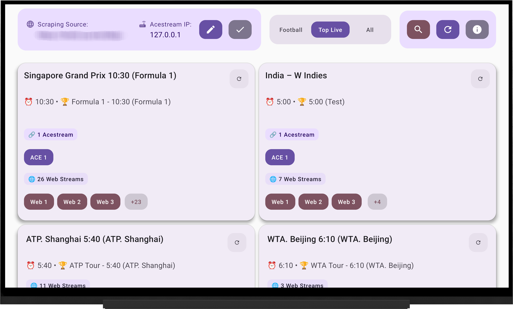

# LiveTV Android TV App

A modern Android TV app for streaming. Features a clean Material Design interface with configurable sources, multiple stream format support, and automatic update functionality.


## Android TV Interface  


## 📱 Download & Install

### Quick Download
- **Latest Release**: [Download APK](https://github.com/FraPorta/LiveTVAndroidApp/releases/latest) (v1.0.13+)
- **All Versions**: [Releases Page](https://github.com/FraPorta/LiveTVAndroidApp/releases)

### Installation
1. Download the latest APK from releases
2. Enable "Unknown Sources" in your Android settings  
3. Install the APK on your device
4. Enjoy live sports streaming!

> 💡 **Auto-Update Available**: Once installed, the app can update itself automatically via the built-in update system - no need to manually download future versions!

## ✨ Features

- **🏈 Football Focus**: Football matches as the default section
- **🎨 Modern UI**: Material Design 3 with responsive layout
- **📱 Responsive**: Optimized for TV, tablet, and phone screens
- **⚡ Performance**: Pagination for faster loading
- **🔄 Auto-Update**: Built-in update system checks GitHub releases
- **🔒 Secure Updates**: Signed APK verification for safe installations  
- **🌐 Multi-Source**: Acestream, M3U8, RTMP, and web streams
- **⚙️ Configurable**: Customizable scraping source URLs

## 🚀 Quick Start

### For Users
1. Download the APK from [releases](https://github.com/FraPorta/LiveTVAndroidApp/releases)
2. Install on your Android TV/device  
3. Launch and enjoy live sports!
4. **Pro tip**: Use the built-in "Check for Updates" feature to stay current with the latest version!

## 🛠️ Development

### Prerequisites
- Android Studio Arctic Fox or newer  
- JDK 17+
- Android SDK 21+ (Android 5.0+)
- Target SDK 34 (Android 14)

### Build Process
```bash
# Clone repository
git clone https://github.com/FraPorta/LiveTVAndroidApp.git
cd LiveTVAndroidApp

# Build debug APK
./gradlew assembleDebug

# Build release APK  
./gradlew assembleRelease
```

## 🔄 Automated Deployment

This project uses GitHub Actions for **fully automated** releases:

- **🚀 Push to `master`**: Automatically creates releases with proper version numbers
- **🏷️ Tagged releases**: Optional milestone releases (e.g., `v2.0.0`)  
- **🔍 Pull requests**: Build verification before merge
- **🛠️ Manual triggers**: On-demand builds for testing

**✨ No manual release process needed - just push your code!**

## 🔄 Auto-Update System

The app includes a built-in update system that:

- **🔍 Checks GitHub releases** for newer versions automatically
- **📦 Downloads APK** with progress tracking  
- **🔐 Verifies signatures** to ensure secure updates
- **⚡ One-click install** with native Android installer
- **🛡️ Fallback support** for both release and debug APKs

Users can check for updates manually via the "Check for Updates" button in the app, or the system can be configured to check automatically on app launch.

## 📋 Project Structure

```
├── app/
│   ├── src/main/java/com/example/livetv/
│   │   ├── ui/              # UI components (Compose)
│   │   │   ├── HomeScreen.kt     # Main interface with update button
│   │   │   └── UpdateDialog.kt   # Auto-update UI component
│   │   ├── data/            # Data layer
│   │   │   ├── network/          # Network and scraping
│   │   │   └── updater/          # Auto-update system
│   │   │       ├── UpdateManager.kt     # GitHub API integration
│   │   │       └── UpdateViewModel.kt   # Update state management
│   │   └── model/           # Data models
│   ├── keystore/           # Release signing keys (gitignored)
│   └── build.gradle.kts    # Build configuration with auto-versioning
├── .github/
│   └── workflows/          # GitHub Actions CI/CD
│       └── build-and-release.yml    # Automated build & release
├── docs/                   # Screenshots and documentation
├── keystore.properties     # Local keystore config (gitignored)
├── KEYSTORE_SETUP.md      # Keystore setup guide
├── setup-github-secrets.sh # Helper script for CI setup
├── release.sh             # Release automation script
└── DEPLOYMENT.md          # Deployment guide
```

## 🤝 Contributing

Contributions are welcome! Please:

1. Fork the repository
2. Create a feature branch: `git checkout -b feature/amazing-feature`
3. Make your changes
4. Add tests if applicable
5. Commit: `git commit -m 'Add amazing feature'`
6. Push: `git push origin feature/amazing-feature`
7. Open a Pull Request

## 📝 License

This project is open source and available under the [MIT License](LICENSE).

## ⚠️ Disclaimer

This app is for educational purposes only. The content is sourced from third-party websites. The developers are not responsible for the content and do not host any streams. Please ensure you have the legal right to view content in your jurisdiction.
